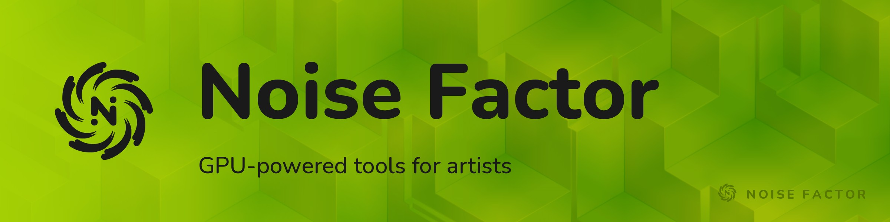

<!-- repo-hero -->

We're making GPU-powered tools for artists.

[Noisedeck](https://noisefactor.io/noisedeck) is a video synth for realtime shader art and live visuals. Free to use, powered by our open source engine.

[Noisemaker](https://noisefactor.io/noisemaker) is an open source shader engine for the browser.
